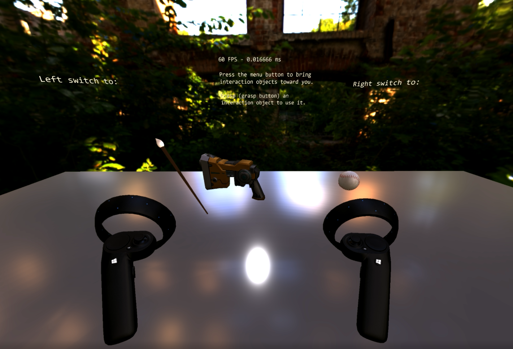

# Demo Room Sample

## Description
The Demo Room Sample is a UWP application which demonstrates a variety of Windows Perception APIs for Windows Mixed Reality devices. Features and best practices demonstrated include:

### Spatial Interaction API
- Motion Controller System
  - How to render controller with pose prediction and update prediction twice for each frame
    - [SpatialInteractionManager::GetDetectedSourcesAtTimestamp](https://docs.microsoft.com/uwp/api/windows.ui.input.spatial.spatialinteractionmanager)
    - [HolographicFrame::UpdateCurrentPrediction](https://docs.microsoft.com/uwp/api/windows.graphics.holographic.holographicframe)
    - [SpatialInteractionSourceProperties::TryGetLocation](https://docs.microsoft.com/uwp/api/windows.ui.input.spatial.spatialinteractionsourceproperties)
- Throwing Tool
  - How to get and calculate throwing velocity relative to the tip of the controller using the SourceReleased event.
    - [SpatialInteractionManager::SourceReleased](https://docs.microsoft.com/uwp/api/windows.ui.input.spatial.spatialinteractionmanager)
    - [SpatialInteractionSourceProperties::TryGetLocation](https://docs.microsoft.com/uwp/api/windows.ui.input.spatial.spatialinteractionsourceproperties)
- Shooting Tool
  - How to align gun model using grip pose, i.e. overlap the virtual gun with the physical controller.
  - How to align the gun's barrel using grip pose so bullets are generated in the correct location.
  - How to trigger haptics for firing events.
    - [SpatialInteractionController::SimpleHapticsController::SendHapticFeedbackForDuration](https://docs.microsoft.com/uwp/api/windows.ui.input.spatial.spatialinteractioncontroller)
- Painting Tool
  - How to use SourceUpdated events for more stable painting
      - [SpatialInteractionManager::SourceUpdated](https://docs.microsoft.com/uwp/api/windows.ui.input.spatial.spatialinteractionmanager)
  - How to paint using paint brush tip (3d model)
  - How to use touchpad to implement a radio menu
    - [SpatialInteractionSourceState::ControllerProperties::Touchpad[X/Y]](https://docs.microsoft.com/uwp/api/windows.ui.input.spatial.spatialinteractionsourcestate)
  - How to use SpatialPointerInteractionSourcePose to display a ray from controller
    - [SpatialInteractionSourceProperties::SourcePointerPose](https://docs.microsoft.com/uwp/api/windows.ui.input.spatial.spatialinteractionsourcelocation)

Any details around Motion Controller rendering are better explained in the [Render Controller sample](../RenderController/)

This sample is written using the recently released C++/WinRT library instead of C++/CX. This requires using the latest features provided by C++17.

## Usage

Instructions are displayed in the environment of the DemoRoom
- Press 'Menu' on the Motion Controller to bring the tools closer to you
- Press 'Grasp' while holding the controller near the tool to activate it
- Press 'Thumbstick' to delete persistent paint strokes created by the Painting Tool.
- Help text for each tool will be displayed on the text panels in the DemoRoom
  - The left panel will display help text for the left controller and the right panel will display help text for the right controller.

## Details

The sample relies on additional projects and open-sourced libraries:
- Neso - A simple ECS engine for real-time simulations.
- [TinyGLTF](https://github.com/syoyo/tinygltf) - A header only C++ glTF 2.0 library.
- Gltf - Helper functions to parse data returned by TinyGLTF.
- Pbr - Shaders and code for creating and rendering models in DirectX 11 using the PBR Metallic-Roughness model.
- SpatialInputUtilities - Utilities for handling spatial input sources including motion controllers.

DemoRoomMain is where the engine is created and all the systems are added, this is also where resource loading happens (for the different models/PBR materials)

## System Requirements

- *Client:* Windows 10 Fall Creators Update (10.0.16299.0 or newer).
- *Visual Studio:* Visual Studio 2017  Version 15.4 or newer.
- *Windows SDK:* Windows 10  Fall Creators Update SDK.

## Build and run the sample

1. Clone the repo.
2. Open DemoRoom.sln
3. Change the active solution platform to x64.
4. Select **Build** \> **Build Solution** to build or **Debug** \> **Start Without Debugging** to run.